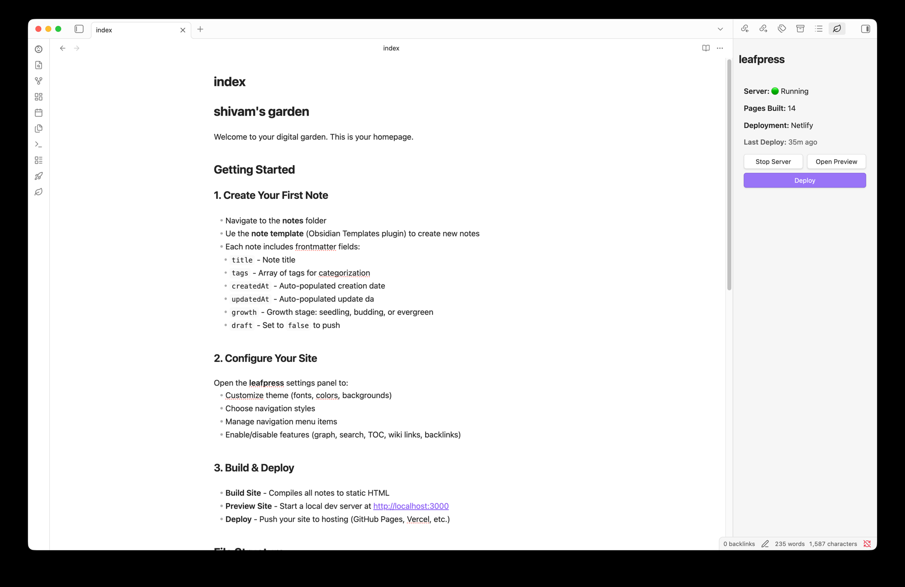
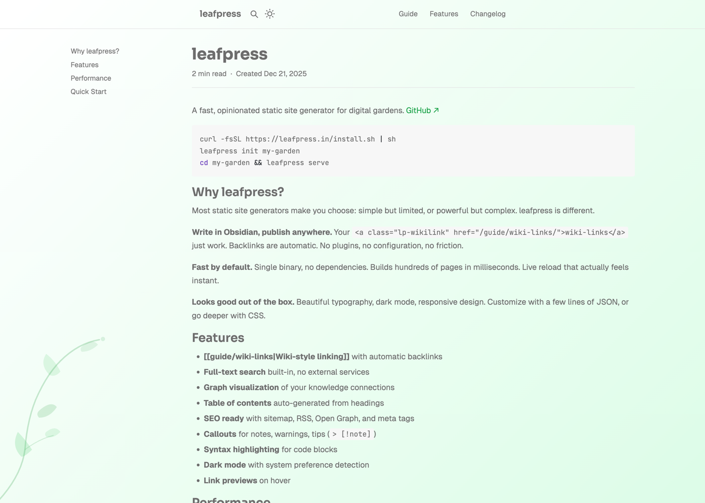

# leafpress for obsidian

Turn your Obsidian vault into a beautiful digital garden. Build, preview, and deploy your notes as a static website—all without leaving Obsidian.


## Screenshot



## Sample garden at [leafpress.in](https://leafpress.in)



## Features

- **One-click publishing** — Build and deploy your vault without touching the command line
- **Live preview** — Start a local server to preview your site before publishing
- **Deploy anywhere** — GitHub Pages, Vercel, or Netlify with built-in deployment support
- **Full theme control** — Customize fonts, colors, backgrounds, and navigation styles
- **Wiki-links support** — Your `[[links]]` just work
- **Graph visualization** — Interactive graph view of your notes
- **Table of contents** — Auto-generated TOC for long-form content
- **Backlinks** — See what links to the current page
- **Full-text search** — Built-in search across all your published notes
- **Change tracking** — See pending changes before you deploy

## Installation

### From Obsidian Community Plugins (Coming Soon)

1. Open **Settings → Community plugins**
2. Search for "leafpress"
3. Click **Install**, then **Enable**

### Manual Installation

1. Download `main.js`, `manifest.json`, and `styles.css` from the [latest release](https://github.com/shivamx96/leafpress-obsidian/releases/latest)
2. Create folder: `<your-vault>/.obsidian/plugins/leafpress/`
3. Copy the downloaded files into this folder
4. Restart Obsidian and enable the plugin in **Settings → Community plugins**

### Using BRAT (Beta Testing)

1. Install [BRAT](https://github.com/TfTHacker/obsidian42-brat) from Community Plugins
2. Open BRAT settings → **Add Beta Plugin**
3. Enter: `shivamx96/leafpress-obsidian`

## Quick Start

1. **Initialize your site** — Open the leafpress panel and click "Initialize" to create `leafpress.json`
2. **Configure** — Set your site title, description, and theme in plugin settings
3. **Preview** — Click "Start Server" to preview at `http://localhost:3000`
4. **Deploy** — Connect a deployment provider and click "Deploy"

## Configuration

All site configuration is stored in `leafpress.json` at your vault root. You can edit this directly or use the plugin settings panel.

### Theme Options

| Option | Description | Default |
|--------|-------------|---------|
| `fontHeading` | Google Font for headings | Crimson Pro |
| `fontBody` | Google Font for body text | Inter |
| `fontMono` | Google Font for code | JetBrains Mono |
| `accent` | Accent color (hex) | #50ac00 |
| `background.light` | Light mode background | #ffffff |
| `background.dark` | Dark mode background | #1a1a1a |
| `navStyle` | Navigation style: `base`, `sticky`, `glassy` | base |
| `navActiveStyle` | Active link style: `base`, `box`, `underlined` | base |

### Feature Toggles

| Feature | Description | Default |
|---------|-------------|---------|
| `graph` | Interactive graph visualization | false |
| `toc` | Table of contents on pages | true |
| `search` | Full-text search | true |
| `wikilinks` | Process `[[wiki-links]]` | true |
| `backlinks` | Show backlinks section | true |

## Deployment

leafpress supports multiple deployment providers:

- **GitHub Pages** — Free hosting directly from your repository
- **Vercel** — Fast edge network with automatic deployments
- **Netlify** — Simple deploys with form handling and more

Configure your provider in plugin settings, then use the Deploy button in the leafpress panel.

## Requirements

- Obsidian 1.11.0 or higher
- Desktop only (macOS, Windows, Linux)

## Documentation

For full documentation on leafpress, visit the [leafpress docs](https://leafpress.in).

## Support

- **Issues & Bugs** — [GitHub Issues](https://github.com/shivamx96/leafpress-obsidian/issues)
- **Discussions** — [GitHub Discussions](https://github.com/shivamx96/leafpress-obsidian/discussions)

## Contributing

Contributions are welcome! Please read our contributing guidelines before submitting a PR.

```bash
# Clone the repo
git clone https://github.com/shivamx96/leafpress-obsidian.git

# Install dependencies
pnpm install

# Development build with watch
pnpm run dev

# Production build
pnpm run build
```

## License

[MIT](LICENSE)

---

Made with ♥ by [Shivam Shekhar](https://github.com/shivamx96)
